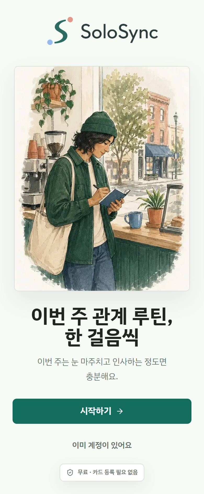
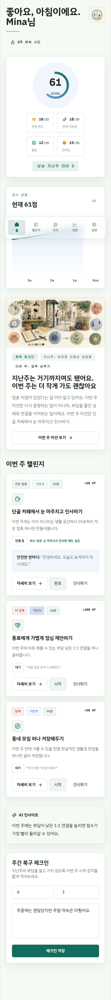
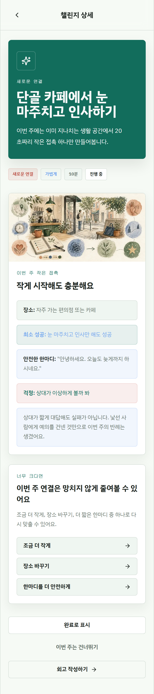
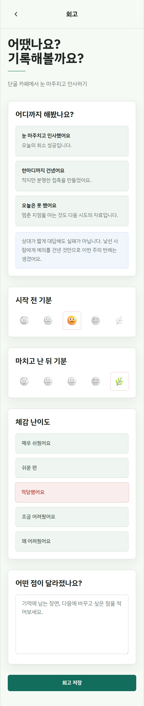
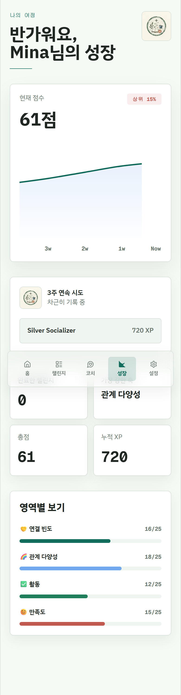

# SoloSync 포트폴리오 데모 패키지

마지막 업데이트: 2026-05-07

## 한 줄 소개

SoloSync는 작은 관계 루틴을 주간 micro-mission으로 실천하게 돕는 PWA입니다.

## 데모 링크

- Preview deployment: `solosyncapp-4v4csk7eo-culgamyuns-projects.vercel.app`
- 검증용 share URL: https://solosyncapp-4v4csk7eo-culgamyuns-projects.vercel.app/?_vercel_share=odFcsE098Urp3nAqnDAH5pjiTSkcCYQY
- Share URL 만료: 2026-05-07 23:04:57 KST

Vercel Authentication이 켜진 preview 링크는 만료되는 share token이 필요합니다. 장기 공개 포트폴리오 링크에는 새 share URL을 발급하거나, 별도 공개 demo deployment를 사용하세요.

## 권장 walkthrough

1. `/ko/welcome`에서 제품 정체성을 확인합니다.
2. QA bypass preview에서는 `/api/qa/auth-bypass?next=/ko/home`으로 데모 세션을 시작합니다.
3. `home`에서 이번 주 관계 루틴을 확인합니다.
4. `challenge detail`에서 safe line, minimum win, field-note 맥락을 확인합니다.
5. `reflection`에서 회고를 저장합니다.
6. `progress`에서 미션 기록 후 성장 화면으로 이어지는 루프를 확인합니다.

## 검증 결과

- Preview smoke: 21 tests 통과
- Preview portfolio/accessibility E2E: 4 tests 통과
- 스크린샷 캡처 중 console error 없음
- 모바일 390px 캡처 기준 horizontal overflow 없음
- Production deployment에서 QA auth bypass 차단 확인

## 스크린샷

